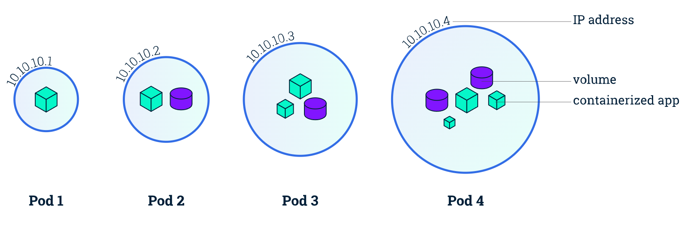
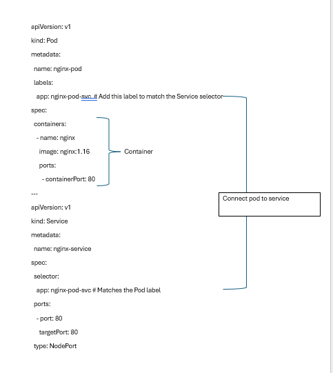

<h2>Pods in Kubernetes</h2>


- [Pods in Kubernetes](#pods-in-kubernetes)
  - [What is a Pod?](#what-is-a-pod)
  - [Key Points about Pods](#key-points-about-pods)
  - [single container and multi-container Pods?](#single-container-and-multi-container-pods)
  - [simple Pod](#simple-pod)
  - [Multiple Container pod](#multiple-container-pod)
  - [What is the replica set?](#what-is-the-replica-set)
  - [How to communicate with pod to service?](#how-to-communicate-with-pod-to-service)

## What is a Pod?
In Kubernetes, a Pod is the smallest and simplest deployable unit. It represents a single instance of a running process in your cluster. A Pod can contain one or more tightly coupled containers that share the same network, storage, and namespace. Pods are ephemeral resources — they can be terminated and recreated on other nodes as needed.
## Key Points about Pods
**Atomic Unit:** A Pod encapsulates one or more application containers, storage resources, a unique network IP, and configuration options. It's the basic building block of Kubernetes applications.

**Containers:** Pods can contain one or more containers, which are managed as a single entity within the Pod. These containers share the same network namespace, allowing them to communicate with each other using localhost.

**Networking:** Each Pod in Kubernetes is assigned a unique IP address, which allows communication between Pods and external clients or other Pods within the same cluster.

**Storage**: Pods can define volumes that are mounted into their containers, allowing them to share data between containers or persist data beyond the lifetime of the Pod.

**Lifecycle**: Pods have a lifecycle managed by the Kubernetes control plane. They can be created, updated, and terminated based on deployment configurations, scaling requirements, or failures.

**Atomicity and Scalability**: Pods are atomic units that can be replicated and scaled horizontally. You can create multiple replicas of a Pod to handle increased load or ensure high availability.

<p align="center">
 
<br/>
Pic: Pods in Kubernetes
</p>

## single container and multi-container Pods?
Running a single container in a pod is a common use case. Here, the pod acts as  a wrapper around the single container and kubernetes the pods rather than the containers directly.
We can also run multiple containers in a pod.
## simple Pod
 Create  an Nginx
 `kubernetes run nginx --image=nginx`
Dry run nginx
`kubernetes run nginx --image=nginx --dry-run=client -o yaml > nginx.yaml`
Run with labels 
`kubernetes run redis -l tier=db --image=redis:alpine`
Deploy a `redis` pods using the `redis:alpine` image with the labels set to `tier=db`
`kubernetes run redis --image-redis:alpine --labels tier=db`
List all pods in all namespaces
`kubernetes get pods --all-namespaces`

## Multiple Container pod
This output confirms that your pod multi-container pods has two containers
`kubernetes get pods multi-container-pod -o jsonpath="{.spec.container[*].name}';echo`
check logs of each container.
```
kubernetes logs multi-container-pod -c nginx-container
kubernetes logs multi-container-pod -c redis-container
```
Exec into the pod
`kubernetes exec multi-container-pod -c nginx-container -it bash`

## What is the replica set?
In Kubernetes, a ReplicaSet is a controller that ensures a specified number of identical Pod replicas are running at any given time. It’s part of the core Kubernetes architecture and helps with scaling and high availability of applications.
*Key Points About ReplicaSet:*
- `Pod Replication`: A ReplicaSet manages the scaling of a group of identical Pods, ensuring that the desired number of replicas (Pods) is always maintained.

-`Self-Healing`: If a Pod managed by a ReplicaSet fails or is deleted, the ReplicaSet automatically creates a new Pod to maintain the specified number of replicas.

-`Declarative Configuration`: You define the desired state (e.g., 3 replicas) in the ReplicaSet, and Kubernetes ensures the system matches that state.

- `Scaling`: You can easily scale applications up or down by adjusting the replica count in the ReplicaSet configuration.

- `Label Selector`: ReplicaSets use label selectors to identify and manage the Pods it controls. Only Pods matching the label selector will be managed by the ReplicaSet.


##  How to communicate with pod to service?

<p align="center">

Pic 1: Nginx Pod
</p>


